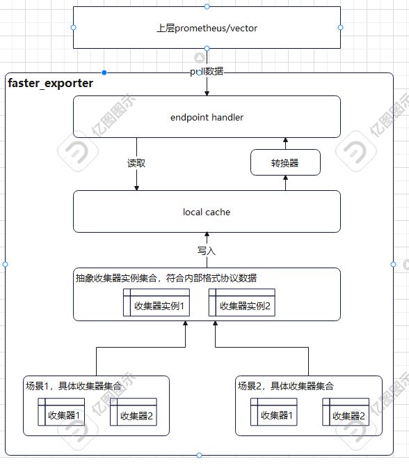

# faster_exporter
一种基于本地缓存的高效采集框架：
### 背景及痛点解决：
- 1、业务数据的采集场景复杂多样。依据依赖倒置原则，框架抽象出采集器数据类型，具体业务去实现接口协议即可。
- 2、prometheus标准数据上报流程需要用户了解。框架完成数据解析和上报工作，业务开发人员不必关心数据如何从endpoint暴漏，对数据采集和解析上报实现分层解耦。
- 3、业务数据采集性能低。我们需要保证endpoint接口的性能，接口请求时，数据从本地缓存中查询，不直接进行业务数据采集，避免造成性能问题。
### 框架图：
